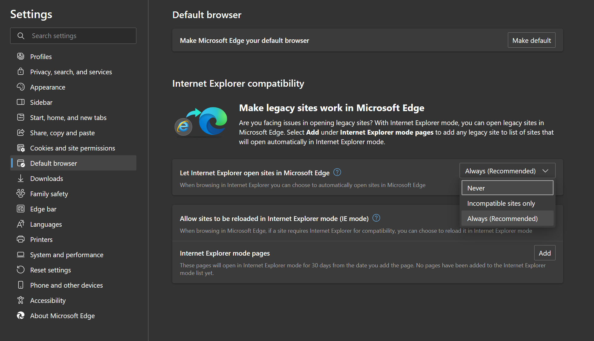
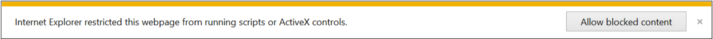
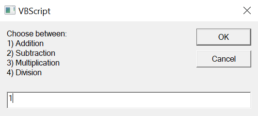
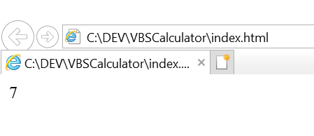

# VBSCalculator

- [VBSCalculator](#vbscalculator)
    - [What is Visual Basic Script](#what-is-visual-basic-script)
    - [Set-up Visual Basic Script](#set-up-visual-basic-script)
      - [Run in Internet Explorer](#option-1-run-in-internet-explorer)
      - [Run in Edge with "Internet Explorer mode"](#option-2-run-in-edge-with-internet-explorer-mode)
    - [Execute the calculator](#execute-the-calculator)
    - [Use the calculator](#use-the-calculator)

## What is Visual Basic Script
Visual Basic Script or VBScript was created by Microsoft in 1996. It was originally created for Internet Explorer or IE.
So this is how we are going to use it. VBScript is disabled by default in IE since August 13, 2019 for windows 7, 8 and 8.1 and July 9, 2019 for windows 10 but can still be used at the time of writing However we do need the use a special meta tag to allow IE 11 to run the VBScript `<meta http-equiv="x-ua-compatible" content="IE=10">`.

## Set-Up Visual Basic Script
There are 2 options for running VBScript.
### **Option 1: Run in Internet Explorer**
  First of all you will need to get IE running. If you can simpy run IE and it starts up normally you can skip this step. If your IE starts and immediately closes again and opens Edge you will have to change a setting in Edge.
  * 1 \
  Open the settings menu in Edge.
  * 2 \
  Navigate to Default browser.
  * 3 \
  Change the "Let Internet Explorer open sites in Microsoft Edge" setting to never
  
  * 4 \
  Now you can run `index.html` with Internet Explorer.

### **Option 2: Run in Edge with "Internet Explorer mode"**
  * 1 \
  Open `index.html`
  * 2 \
  In the top right you can will see the an icon to switch to "Internet Explorer mode". If you click that Edge will switch to "Internet Explorer mode". \
  

## Execute the calculator
After completing one of the options in [Set-up Visual Basic Script](#set-up-visual-basic-script) you will also have to unblock the VBScript. VBScripts are blocked by default in IE 11 and Edges "Internet Explorer mode". \
The notice to run the script will look like this: \

After clicking "Allow blocked content" the VBSCalculator will finally execute!

## Use the calculator
The Calculator is controlled via IE pop-up boxes that look like this: \
 \
After all 3 inputs have be filled out the result will appear in the browser. \

